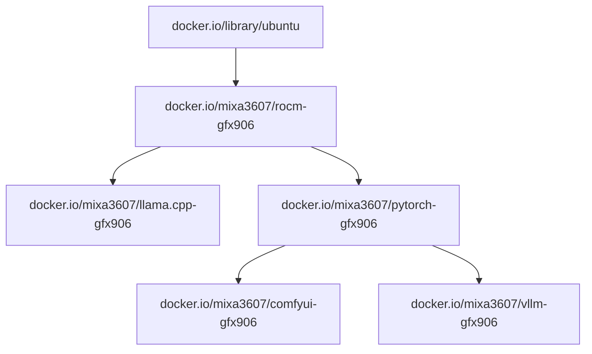

# ML software for deprecated GFX906 arch

> **Mirror note:** this repo is a GitHub-hosted mirror with the apt repository
> served entirely from GitHub (Pages + Releases). See
> [README-APT-GITHUB.md](./README-APT-GITHUB.md) for install/publish instructions
> and [DEPLOYMENT-PLAN.md](./DEPLOYMENT-PLAN.md) for the migration plan.


[](https://discord.gg/EgsTWBqPr)
[](https://arkprojects.space/wiki/AMD_GFX906)

## Docs

> Legacy builds (pre-TheRock) are **no longer supported** starting from the
> `20260802001858` release. If you are stuck on an old build (e.g. `6.3.3`)
> because of issues with the new TheRock builds, please
> [open an issue](https://github.com/mixa3607/ML-gfx906/issues).

https://arkprojects.space/wiki/AMD_GFX906

### Add the repository (Ubuntu 24.04)

This mirror hosts the apt repository on **GitHub Releases** (flat repo —
`deb URL ./`). The original upstream repo is served from
`s3.arkprojects.space` (see the block at the bottom of this section).

```bash
sudo apt-get update
sudo apt-get install ca-certificates curl -y
sudo install -m 0755 -d /etc/apt/keyrings
sudo curl -fsSL https://phantomic12.github.io/ML-gfx906/pubkey.asc -o /etc/apt/keyrings/apt-gfx906.asc
sudo chmod a+r /etc/apt/keyrings/apt-gfx906.asc
sudo tee /etc/apt/sources.list.d/gfx906.sources <<EOF
Types: deb
URIs: https://github.com/phantomic12/ML-gfx906/releases/download/20260802001858
Suites: ./
Signed-By: /etc/apt/keyrings/apt-gfx906.asc
EOF
sudo apt-get update
```

One-line form:
`deb [signed-by=/etc/apt/keyrings/apt-gfx906.asc] https://github.com/phantomic12/ML-gfx906/releases/download/20260802001858 ./`

<details>
<summary>Original upstream repo (homelab S3, same packages)</summary>

```bash
sudo curl -fsSL https://s3.arkprojects.space/apt-gfx906/ubuntu/gpg -o /etc/apt/keyrings/apt-gfx906.asc
sudo tee /etc/apt/sources.list.d/gfx906.sources <<EOF
Types: deb
URIs: https://s3.arkprojects.space/apt-gfx906/ubuntu
Suites: $(. /etc/os-release && echo "$VERSION_CODENAME")
Components: main
Architectures: $(dpkg --print-architecture)
Signed-By: /etc/apt/keyrings/apt-gfx906.asc
EOF
```

</details>

### Test the repository

Verify the repo works before installing anything big. Every command below is
safe — nothing gets installed until the last (optional) step.

```bash
# 1. Repo visible + signed. Expected: "Get:1 ... ./ InRelease" with NO
#    "NO_PUBKEY" / "is not signed" / "trusted=yes" warnings.
sudo apt-get update

# 2. A known package resolves from the repo.
apt-cache policy amdrocm-amdsmi7.14
#    Expected: candidate 7.14.0-gfx906+20260802001858 from
#    https://github.com/phantomic12/ML-gfx906/releases/download/20260802001858

# 3. Download a small package (4 MB, deps: libc6, python3) WITHOUT installing.
cd /tmp
apt-get download amdrocm-amdsmi7.14
dpkg-deb -I amdrocm-amdsmi7.14_*.deb | head -15

# 4. Downloaded file matches the signed index (SHA256 must be identical).
sha256sum amdrocm-amdsmi7.14_*.deb
curl -fsSL https://github.com/phantomic12/ML-gfx906/releases/download/20260802001858/Packages \
  | awk '/^Package: amdrocm-amdsmi7.14$/{f=1} f&&/^SHA256:/{print "index:", $2; exit}'

# 5. (optional) Actually install the small package.
sudo apt-get install -y amdrocm-amdsmi7.14
amdsmi_cli --help

# Done testing? Remove the source:
sudo rm -f /etc/apt/sources.list.d/gfx906.sources
sudo apt-get update
```

> Don't test-install the big ROCm packages (`amdrocm-dnn7.14-gfx906` ~325 MB,
> `amdrocm-llvm7.14` ~146 MB, etc.) on a machine you care about — they pull a
> full ROCm runtime. The index lists 145 packages; browse them with
> `apt-cache search amdrocm-` after adding the repo.

### Subprojects

| Name                  | About                   | Artefacts    | Status                                                                                                                                                             | Docs                                        |
| --------------------- | ----------------------- | ------------ | ------------------------------------------------------------------------------------------------------------------------------------------------------------------ | ------------------------------------------- |
| ROCm                  | ROCm bulds              | deb, image   |                 | [readme](./rocm/README.md)                  |
| ROCm Validation Suite | ROCm Validation Suite   | deb          |  | [readme](./rocm-validation-suite/README.md) |
| ROCm TransferBench    | ROCm TransferBench      | deb          |    | [readme](./rocm-transfer-bench/README.md)   |
| AMD Memory Tweak      | AMD HBM2 timing tool    | deb          |       | [readme](./amd-memory-tweak/README.md)      |
| AMD Tuning            | Tool for AMD GPU tuning | deb          |             | [readme](./amd-tuning/README.md)            |
| PyTorch               | PyTorch                 | wheel, image |              | [readme](./pytorch/README.md)               |
| llama.cpp             | llama.cpp               | image        |        | [readme](./llama.cpp/README.md)             |
| ComfyUI               | ComfyUI                 | image        |              | [readme](./comfyui/README.md)               |
| ROCm Bandwidth Test   | ROCm Bandwidth Test     | deb          | Paused                                                                                                                                                             | [readme](./rocm-bandwidth-test/README.md)   |
| vLLM                  | vLLM                    | image        | Paused                                                                                                                                                             | [readme](./vllm-v2/README.md)               |
| ROCm tensile          | gfx906 tensile files    | files        | Deprecated                                                                                                                                                         | [readme](./rocm-tensile/readme.md)          |

### Deps graph


